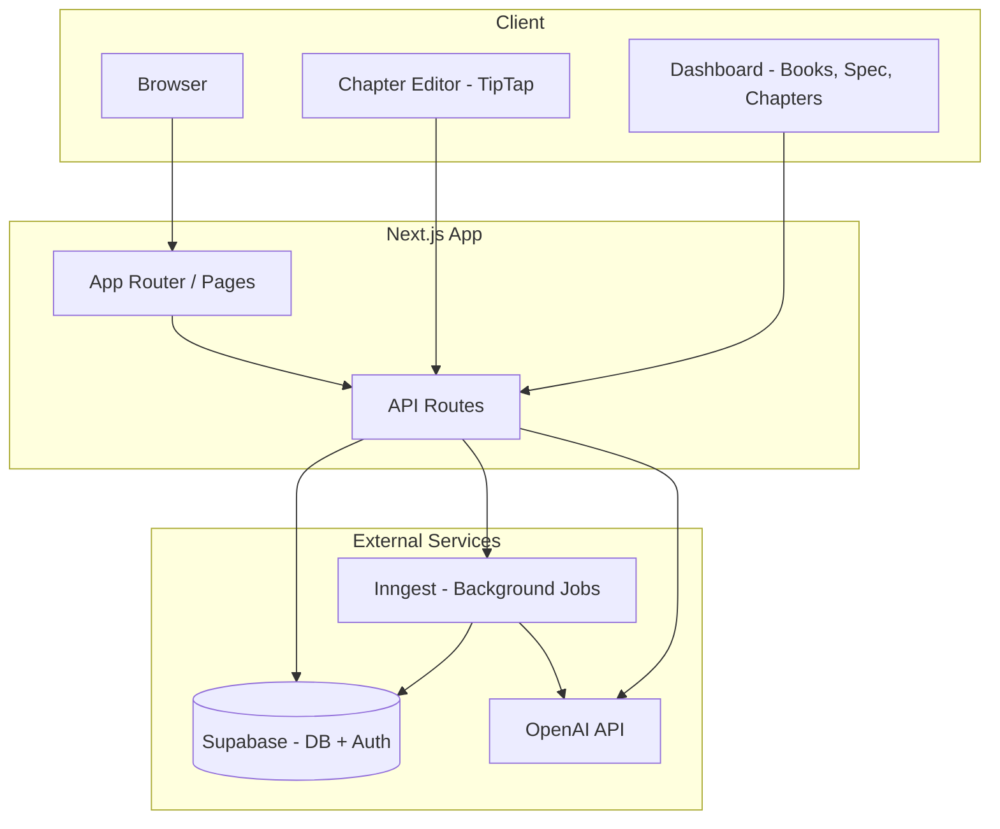
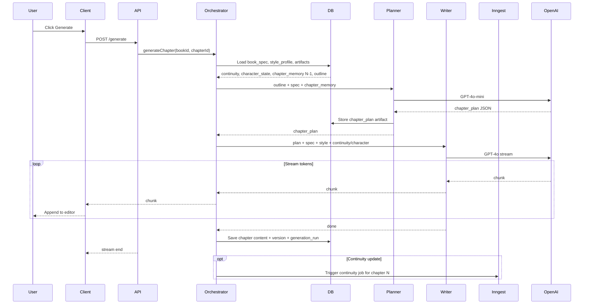
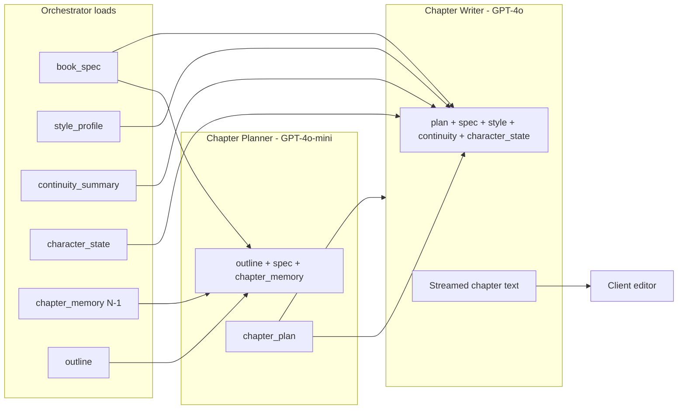
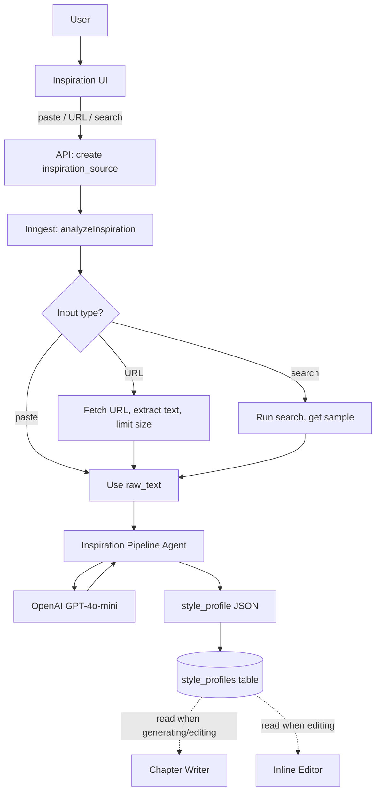
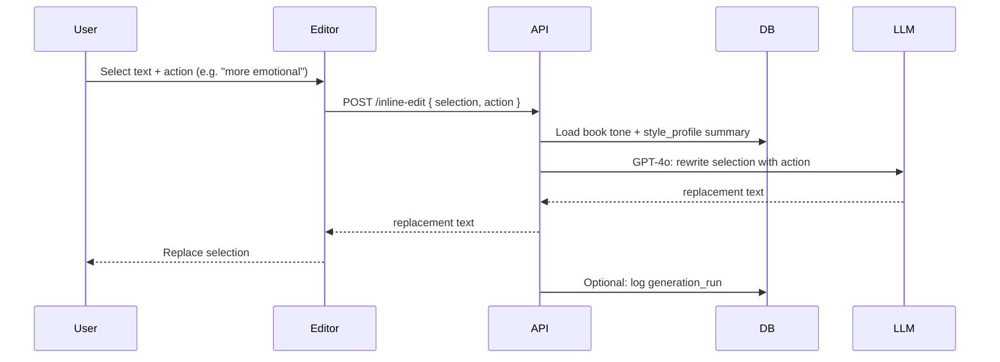
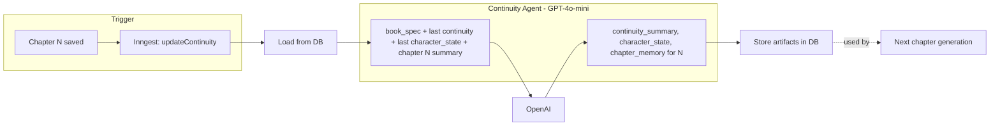
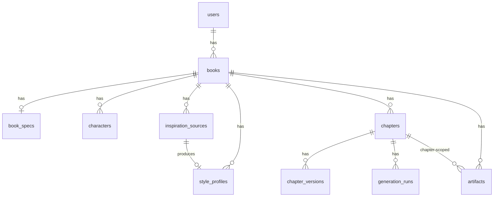
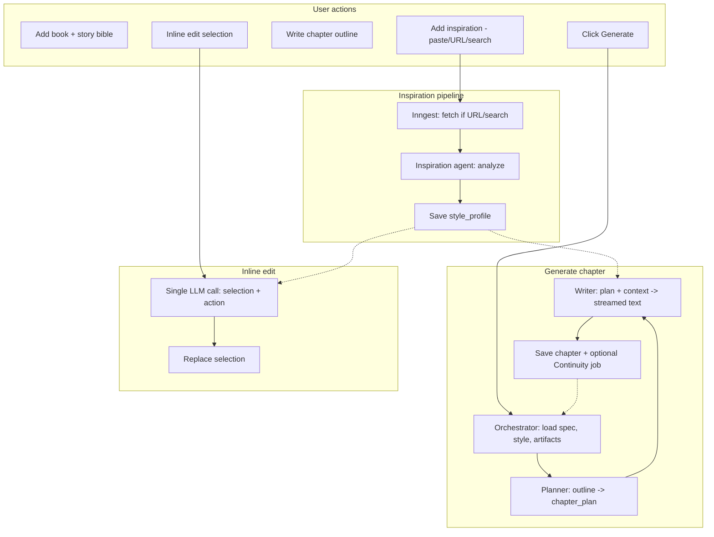

# FableForge: Architecture Diagrams

Mermaid diagrams for the personal-project architecture. Render in GitHub, VS Code (with Mermaid extension), or any Mermaid-compatible viewer.

---

## 1. High-level system architecture

---

## 2. Generate chapter: agent pipeline (sync)

User clicks "Generate" → Orchestrator runs Planner then Writer; streams result to editor. Optional: after save, Continuity agent runs async.

---

## 3. Agent handoff and data flow (generate path)

What each agent consumes and produces; arrows show handoffs.

---

## 4. Inspiration pipeline (async)

User adds inspiration (paste, URL, or search) → Inngest job fetches (if needed), then Inspiration agent analyzes → style_profile saved; Writer and Inline editor use it later.

---

## 5. Inline edit (single call, no pipeline)

User selects text and picks an action → one Writer-style LLM call → replacement text; no other agents.

---

## 6. Continuity agent (async, after chapter save)

Runs in Inngest after a chapter is finalized. Reads last continuity + character_state + new chapter summary; writes updated artifacts for the next chapter.

---

## 7. Data model (core entities and artifacts)

---

## 8. End-to-end flow summary

---

*Diagrams align with the architecture plan: personal project, multi-agent workflow (Orchestrator, Continuity, Planner, Writer, Inline editor, Inspiration pipeline), cost-conscious use of GPT-4o-mini vs GPT-4o.*
